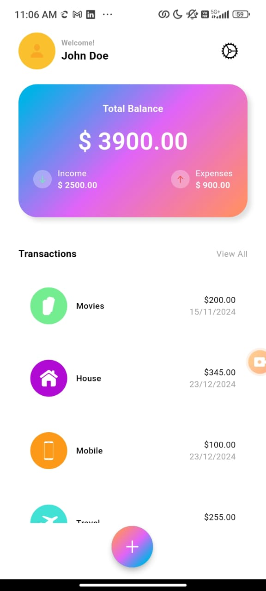
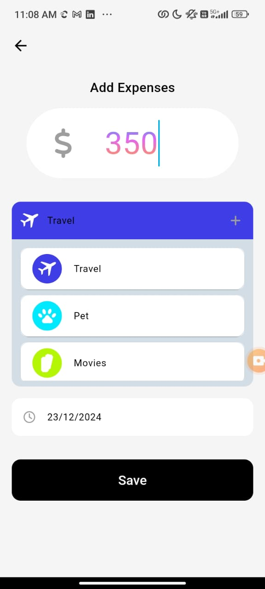
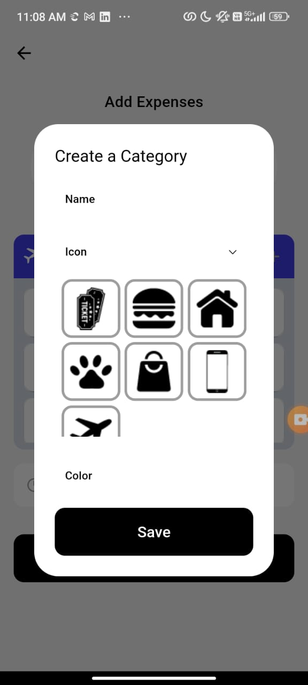

# Expense Tracker Application






## Overview
The **Expense Tracker Application** is a Flutter-based app that allows users to manage their expenses efficiently. It provides functionality for categorizing, adding, updating, deleting, and viewing expenses. Data is persisted using the Hive database, ensuring offline availability. The app leverages the Bloc pattern for state management, ensuring a clean and scalable architecture.

---

## Features
- Add new expenses with details such as amount, category, and date.
- Edit existing expenses.
- Delete expenses.
- Categorize expenses for better organization.
- View all expenses.
- Persistent data storage using Hive.

---

## Technology Stack
- **Flutter**: Frontend development framework.
- **Hive**: Lightweight and fast key-value database for data persistence.
- **Bloc**: State management pattern for predictable state transitions.
- **Firebase**: Placeholder for future integration.
- **Path Provider**: To access device directories for Hive initialization.

---

## Installation and Setup

### Prerequisites
- Flutter SDK installed ([Flutter Installation Guide](https://flutter.dev/docs/get-started/install)).
- Dart installed.

### Steps
1. Clone the repository:
   ```bash
   git clone https://github.com/navaneethkrishnaindeed/expence.git
   cd expence
   ```
2. Install dependencies:
   ```bash
   flutter pub get
   ```
3. Set up Hive:
   - Ensure that the `CategoryAdapter` and `ExpenseAdapter` are registered in the `main()` function.
   - Initialize Hive with the device's document directory using the `path_provider` package.
4. Run the app:
   ```bash
   flutter run
   ```

---

## Project Structure
`lib/
├── application/               # Application logic (Bloc, Cubit, Observers)
│   ├── create_category_bloc/  # Bloc for creating categories
│   ├── create_expense_bloc/   # Bloc for creating expenses
│   ├── get_categories_bloc/   # Bloc for fetching categories
│   ├── get_expenses_bloc/     # Bloc for fetching expenses
│   └── simple_bloc_observer.dart  # Bloc observer for logging state changes
│
├── domain/                    # Core domain layer
│   └── src/
│       ├── entities/          # Entities defining core business data
│       │   ├── category_entity.dart
│       │   └── expense_entity.dart
│       ├── models/            # Models for Hive database
│       │   ├── category.dart
│       │   ├── category.g.dart
│       │   ├── expense.dart
│       │   └── expense.g.dart
│       └── infrastructure/    # Repositories interfaces
│           ├── i_category_repo.dart
│           └── i_entity_repo.dart
│
├── presentation/              # UI and presentation layer
│   ├── components/            # Reusable UI components
│   │   ├── chart.dart         # Charts for visualizing expenses
│   │   └── stats.dart         # Stats display for analytics
│   └── screens/               # Screens for different app views
│       ├── add_expense/       # Screens related to adding expenses
│       │   ├── add_expense.dart
│       │   └── category_creation.dart
│       └── home/              # Home and main screens
│           ├── home_screen.dart
│           ├── main_screen.dart
│
├── app.dart                   # Main app widget
├── app_view.dart              # App-level view widget
└── main.dart                  # Entry point of the application

```

---

## Key Concepts

### Hive Database
- **Adapters**: Custom adapters are created for `Category` and `Expense` models to store objects in Hive.
- **Boxes**: Separate boxes (`categories` and `expenses`) are used for categorizing and storing expense data.

### Bloc Pattern
- **CreateExpenseBloc**: Handles adding a new expense and managing state transitions.
- **GetExpensesBloc**: Fetches all expenses and manages state for displaying expenses.

---

## Testing
### Unit Tests
Unit tests are written for repository and Bloc layers to ensure core functionality.
- Test folder structure mirrors the `lib/` folder for consistency.
- Mocked Hive boxes are used to isolate logic from the actual database.

Run the tests:
```bash
flutter test
```

---

## Future Enhancements
- Integration with Firebase for user authentication and cloud data sync.
- Add filtering and sorting options for expenses.
- Multi-currency support.
- Add charts/graphs to visualize spending patterns.

---

## Contributing
Contributions are welcome! To contribute:
1. Fork the repository.
2. Create a new branch for your feature/bug fix.
3. Submit a pull request with detailed explanations of your changes.


---

## Contact
For any queries or feedback, feel free to reach out:
- Email: navaneethkrishnaindeed@gmail.com
- Portfolio: [My Portfolio Website](https://navaneethkrishnaindeed.github.io/#/)

